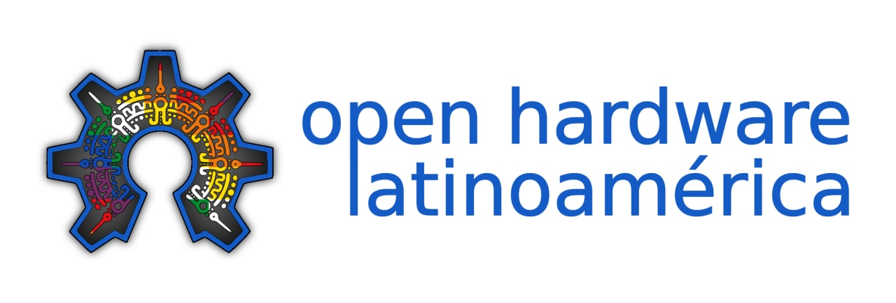
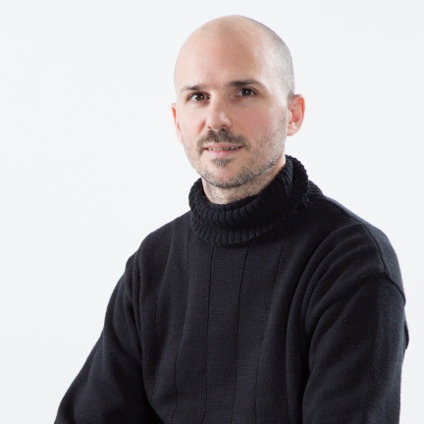

Somos un gurpo autogestionado e internacional de profesionales y entusiastas del Hardware Open Source y el Software Libre

|[img/esteban.jpeg](https://github.com/Open-Hardware-Latinoamerica/.github/blob/main/profile/img/esteban.jpeg))||||||
|--|--|--|--|--|--|
|Esteban Corredor|Maykol Rey|Ronal Forero|Matías S.Ávalos|Yeffri J. Salazar|Juan Carrique|

## Repositorios destacados

* [STM32-bluepill-iomod](https://github.com/Open-Hardware-Latinoamerica/stm32-bluepill-iomod)
* [STM32F1](https://github.com/Open-Hardware-Latinoamerica/STM32F1)
